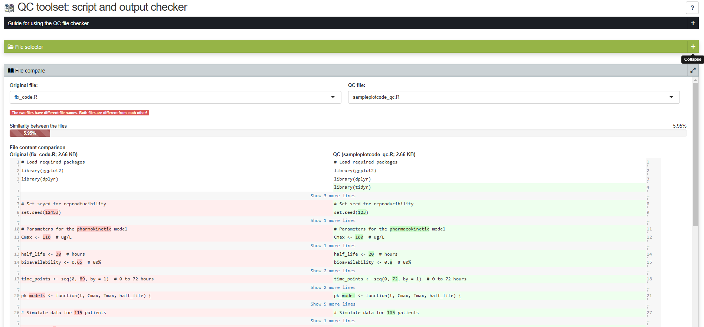

##  Pharmacometric QC tookit: file comparer




__Sample deployed template__: https://pharmacometric.shinyapps.io/qc-tools-shiny-filechecker/


### Why this app may be useful for your QC needs

After preparing report outputs, an analyst may be required to conduct quality control (QC) checks on another analyst's work. During this process, the QC analyst reviews the scripts used to generate the outputs to identify any potential errors. If errors are found, the QC analyst will highlight them for correction. If no errors are detected, the QC analyst will typically regenerate all outputs and compare them against those produced by the original analyst to ensure accuracy. This application facilitates the QC process by allowing analysts to easily verify their outputs against those generated by the original script creator.


Ensuring quality control of scripts and graphical outputs during pharmacometric submissions to regulatory agencies is crucial for several reasons. First, regulatory agencies rely on accurate and reproducible data to assess the safety and efficacy of pharmaceutical products. Any errors in scripts or graphical representations can lead to misinterpretations of results, potentially impacting decision-making and public health. Quality control processes help identify and rectify discrepancies before submission, ensuring that the data presented is both reliable and transparent. Furthermore, high-quality outputs reflect professional standards and enhance the credibility of the research, fostering trust between the submitting organization and regulatory bodies. Ultimately, rigorous quality control not only supports compliance with regulatory requirements but also underpins the integrity of the scientific evaluation process, paving the way for successful submissions and the advancement of safe and effective therapies.


### Usage 
```r

# Download and unzip the content of this repository
# Set working directory to the unzipped folder
setwd("qc-tools-shiny-filechecker")

# Load shiny and run app
library(shiny)
runApp(launch.browser = TRUE)

```

### Features

The following features are available in the current template for you to get started.

 - __User customizable interface__. This means the user can move around the panels to desired locations on the screen. They may also change the title and color of the panels to suite their needs. 
 - __Panel location and features saved across sessions__. This means that after re-arrangement of panels, changing panel colors or titles, one may refresh the page and the settings are retained.
 - __Resizable Panels__. Panels are resizable to allow easy focus on specific contents, like plots or tables of result.

 
 
### Issues

If you have issues or questions, create an 'issue' or contribute to one within the issue tab of this github repository


### Contributors

Contributors interact with the project on GitHub by filing new issues, improving existing issues, or submitting pull requests. Anyone can become a contributor, which means there is no expectation of commitment to the project, no required set of skills, and no selection process.
